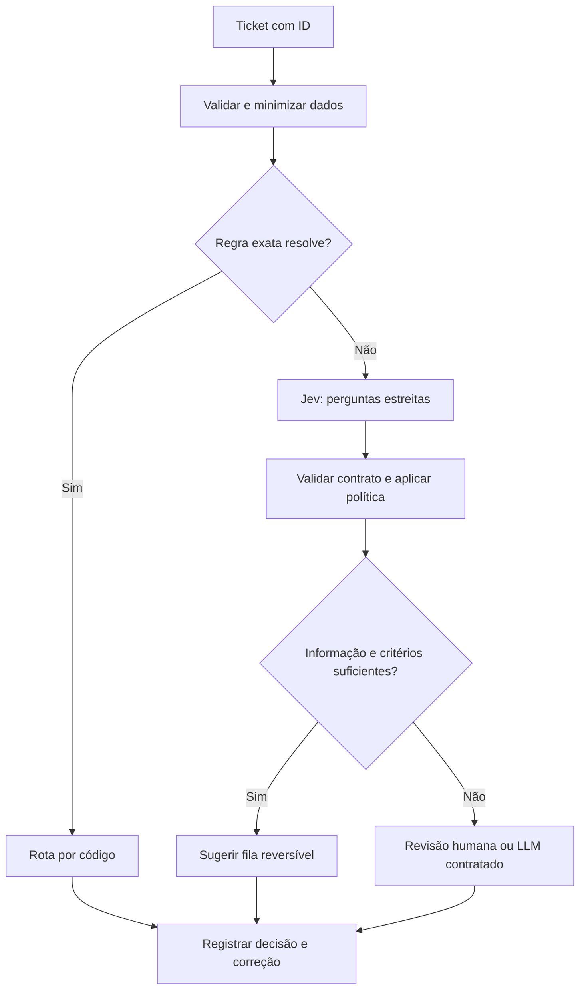

# Plano de aplicação — Jev Decision Lab

## Produto e escopo

Um laboratório local para comparar decisões e recomendar rotas de tickets. Primeiro resultado útil: importar um JSONL anonimizado e produzir relatório de qualidade, tempo, custo e encaminhamentos. Primeiro usuário: responsável por atendimento/automação. Nenhuma conexão a CRM é necessária para provar a hipótese.

MVP proposto: CLI Python, adaptadores de provedor, política de roteamento independente e relatórios JSON/CSV. API HTTP e interface vêm depois se o piloto justificar. O provedor deve ser substituível; não começar construindo uma plataforma de agentes.

## Fluxo

## Decisões do MVP

| Questão | Forma | Política |
|---|---|---|
| Qual fila descreve o pedido principal? | Choice: suporte, cobrança, vendas, outro, insuficiente | Apenas sugestão no piloto |
| Há informação suficiente para rotear? | Choice: suficiente, insuficiente, contraditória | Falta/conflito leva a revisão |
| O pedido exige ação irreversível? | Regra de permissões + sinal auxiliar | Nunca depender só da classificação |
| Há intenção de agendamento e de vendas? | Perguntas independentes na expansão de transcrições | Permitir múltiplas etiquetas |

Quando há duas intenções, usar regra documentada de fila principal ou revisar; não forçar exclusividade onde o produto precisa de várias rotas.

## Contratos propostos

Entrada interna: `event_id`, `text`, `language`, `source`, `received_at`, `allowed_routes`. Campos de identidade pessoal são removidos quando não necessários. O contrato do evento é nosso; não confundir com o payload da API.

Saída interna: ID do evento, fila sugerida, decisão da política (`suggest`/`review`), motivo da política, resposta bruta restrita, modelo resolvido, versões de pergunta e política, duração total, tokens, custo estimado e correção humana posterior. O motivo da política é calculado em código; não é uma explicação gerada pelo Jev.

[Payload de referência](../exemplos/triagem-request.json), alinhado à [API oficial](https://docs.typesafe.ai/api). Chamada planejada: `POST https://api.typesafe.ai/v1/systemone`, autenticação Bearer no backend. Não expor chave em navegador ou repositório. O arquivo JSON ainda não foi testado no serviço.

## Política operacional

1. Rejeitar entrada vazia/inválida antes do provedor; encaminhar ao tratamento operacional.
2. Se tipo/campos/probabilidades forem inválidos, não executar a rota.
3. Escolha `insuficiente`, `outro` sem fila definida, ambiguidade ou baixa segurança empírica: revisão.
4. Limiares de probability e confidence são parâmetros diferentes, ajustados no conjunto de calibração. Sem avaliação aprovada, toda sugestão permanece em observação.
5. Ações permitidas são fixadas por código e credenciais. Modelo não autoriza pagamento, exclusão ou envio externo.
6. Guardar ID idempotente para impedir processamento duplicado; uma correção de humano vence a recomendação anterior.
7. Limitar tentativas a três no total, com prazo global proposto de 5 s para o piloto. Honrar `retry-after`; se exceder o prazo, revisar. Ajustar esses números a partir das medições.
8. Não repetir automaticamente erros de autenticação ou contrato. Em sobrecarga, aplicar backoff e circuito de interrupção para impedir tempestade de chamadas.
9. Não confundir tentativa HTTP com repetição de raciocínio. Ambos têm limites independentes; fallback não deve formar ciclo.
10. Desligamento por configuração retorna ao fluxo anterior. Registrar incidentes e guardar amostras anonimizadas dos erros.

## Etapas e entregáveis

Estimativa de esforço, não compromisso de calendário; considera uma pessoa técnica e apoio de quem conhece o atendimento.

| Etapa | Esforço estimado | Entrega | Condição de saída |
|---|---:|---|---|
| 0 — definir decisões | 1 dia | Taxonomia, critérios e política de dados | Responsável do atendimento consegue rotular exemplos |
| 1 — preparar evidência | 2–3 dias | Dataset revisado e partições congeladas | Duplicatas removidas; desacordos tratados |
| 2 — implementar laboratório | 2–3 dias | CLI, adaptadores, regras, logs e simulador | Erros e limites testados; modo offline reproduzível |
| 3 — comparar | 2 dias | Relatório regras × Jev × LLM × híbrido | Critérios de avaliação publicados antes de abrir teste |
| 4 — observar tráfego | 5–10 dias úteis decorridos | Sugestões sem ação automática + correções humanas | Cobertura das classes e volume suficientes |
| 5 — liberar rota limitada | 1–2 dias + monitoramento | Uma fila reversível, configuração de retorno | Metas atendidas e responsável aceita impacto observado |

Se não houver acesso à API, avançar com rotulagem, baseline e simulador marcado como simulação. Não apresentar latências simuladas como benchmark. Procurar credenciais, quando necessárias, nos dois arquivos de ambiente indicados nas regras globais; carregar em runtime, sem copiar valores.

## Critérios de aceite do produto

Importação reproduzível; nenhuma perda silenciosa de eventos; cada resultado rastreável; custo de retries e fallback contabilizado; rota desconhecida impedida por código; dados reais fora do Git; comando de retorno ao fluxo anterior demonstrado. A qualidade necessária é definida no [protocolo](04-avaliacao.md).

## Após o piloto

Expandir uma aplicação de cada vez: transcrições, revisão editorial e então roteamento de modelos/agentes. Só construir conectores de CRM ou orquestrador quando o consumidor e o contrato estiverem definidos. Trigger.dev, n8n e outros são alternativas futuras, não dependências do MVP.
