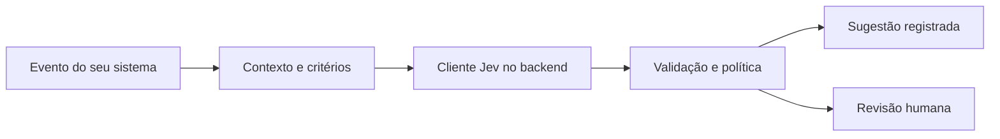

# Como colocar Jev no seu sistema

Jev entra como uma etapa do backend. Seu sistema fornece o contexto e as respostas permitidas; o modelo devolve a classificação. Seu código valida a resposta e decide se apresenta uma sugestão ou encaminha para revisão.



## 1. Escolha uma decisão pequena

Exemplo: um ticket acabou de chegar ao seu sistema. A decisão é a fila sugerida: suporte, cobrança, vendas ou informação insuficiente. O Jev não precisa substituir o help desk.

Escolha um dos [dez pacotes](areas/README.md). Mantenha critérios explícitos e uma alternativa de insuficiência. Quando a entrada exigir briefing, rubrica ou catálogo, forneça esse contexto completo.

## 2. Disponibilize o código no backend

Mantenha um clone deste repo e acrescente seu caminho ao `PYTHONPATH` do processo, ou copie `jev_lab/` e `pacotes/` para o seu projeto preservando a estrutura. Prefira fixar um commit para atualizações revisáveis.

```bash
git clone https://github.com/inematds/jev.git
cd jev
python3 -m pacotes.executar atendimento
```

Esse primeiro comando de execução é offline. Não requer chave nem faz inferência. Os pacotes ainda não são uma distribuição PyPI.

Para outro projeto acessar o clone:

```bash
PYTHONPATH=/caminho/absoluto/jev python3 meu_backend.py
```

## 3. Chame a função na aplicação Python

```python
from pacotes.integracao import avaliar_area

# Exemplo de evento fictício que já pertence ao seu sistema.
ticket = {'id': 'TESTE-123', 'texto': 'Paguei a mesma fatura duas vezes.'}
resultado = avaliar_area('atendimento', ticket['texto'], provider='openrouter')

if resultado['action'] == 'review':
    registro = {'ticket_id': ticket['id'], 'status': 'revisao',
                'motivo': resultado['error'] or 'Critérios de revisão acionados.'}
else:
    resposta = resultado['response']['answers']['decisao']
    registro = {'ticket_id': ticket['id'], 'status': 'sugestao',
                'fila_sugerida': resposta['choice']}

print(registro)  # Troque pelo armazenamento do seu sistema.
```

`avaliar_area` faz uma **consulta real** por padrão. No exemplo acima, configure `OPENROUTER_API_KEY` no ambiente do backend ou no gerenciador de segredos. O cliente mantém a leitura dos arquivos locais autorizados descrita no README principal. Nunca envie a chave para o navegador.

Falha de rede, chave ausente ou resposta inválida encaminha para revisão com `response: null`; não inventa uma classificação. Preserve o evento no seu banco antes da consulta, para uma falha não apagar o trabalho. Erros de configuração do pacote, como área inexistente, devem ser corrigidos pelo integrador.

Os limiares da política são didáticos, não calibrados para seu negócio. Noul e Score precisam de política específica. `suggest` indica uma proposta; execução, permissões e confirmação continuam no sistema chamador.

## 4. Se o sistema não usa Python

Um backend Node.js, PHP, Java ou um orquestrador pode executar o comando abaixo com argumentos separados, sem concatenar dados em um comando de shell:

```bash
python3 -m pacotes.executar atendimento --state-file /caminho/ticket.txt --live --provider openrouter
```

- Entrada: arquivo UTF-8 protegido, criado pelo seu backend. Para JSON, adicione `--state-format json`.
- Saída padrão: JSON com `area`, `origin`, `action`, `response`, `decisions` e `error`.
- Código 0: fluxo concluído; ainda pode resultar em revisão. Código 2: falha; a saída pode conter JSON de revisão ou apenas diagnóstico em stderr.
- Valide código de saída e JSON. Timeout do subprocesso também significa revisão; não descartar o ticket.
- Crie arquivos temporários com nomes exclusivos, limite permissões e apague-os após o uso. Não use títulos ou IDs externos como caminhos sem validação.

Se o volume exigir HTTP, coloque o cliente atrás de uma rota autenticada **do seu backend**, com limite de tamanho, timeout e controle de concorrência. O servidor `jev_lab serve` é uma demonstração local, não uma API pública pronta para produção. Nenhum conector n8n, CRM ou help desk foi implementado nesta entrega.

## 5. Teste antes de automatizar

Comece com as dez demonstrações offline. Em seguida, use eventos rotulados por pessoas, com exemplos incompletos, conflitantes e fora do escopo. Veja [experimentos](../docs/08-experimentos.md). Rode primeiro em observação: registre a sugestão sem alterar o encaminhamento real.

As fixtures são inventadas e seus hashes impedem reutilizá-las silenciosamente após editar o request. Um hash prova correspondência do exemplo, não qualidade nem origem do modelo. Não há benchmark Jev real nesta entrega.

Integração OpenRouter e as dez consultas reais estão documentadas em [Jev pelo OpenRouter](../docs/10-openrouter.md). TypeSafe direta permanece disponível com `provider="typesafe"` e `TYPESAFE_API_KEY`.
